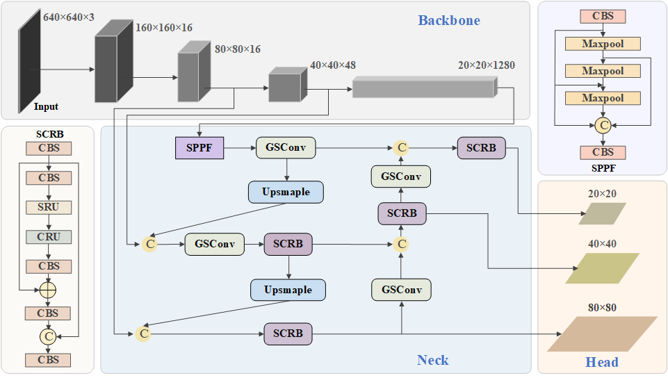
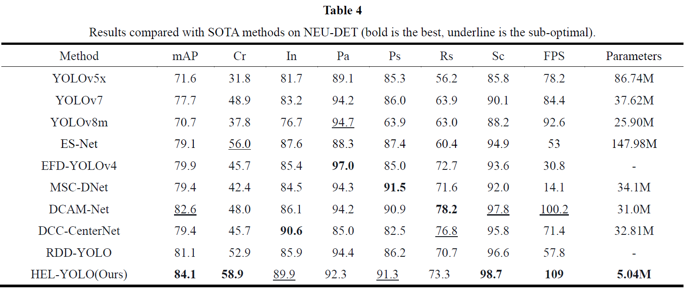
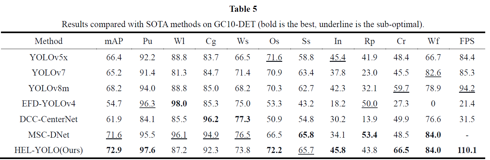

# HE-LightYOLO
An highly efficient and lightweight YOLO for steel surface defects detection.

## Introduction
Here is the structure of the forthcoming HE-LightYOLO.

## :open_file_folder: Dataset and Weight
[Google Drive](https://drive.google.com/drive/folders/1D2u82IgJvb5dgvbWSDDkixV1URJBTvRZ?usp=drive_link)

## :trophy: Result
Our proposed method achieves better performance on NEU-DET and GC10-DET.The specific indicators are shown in Table I and Table II.

PR result plot on NEU-DET

PR result plot on GC10-DET

## Visualization of detection results

NEU-DET

GC10-DET

