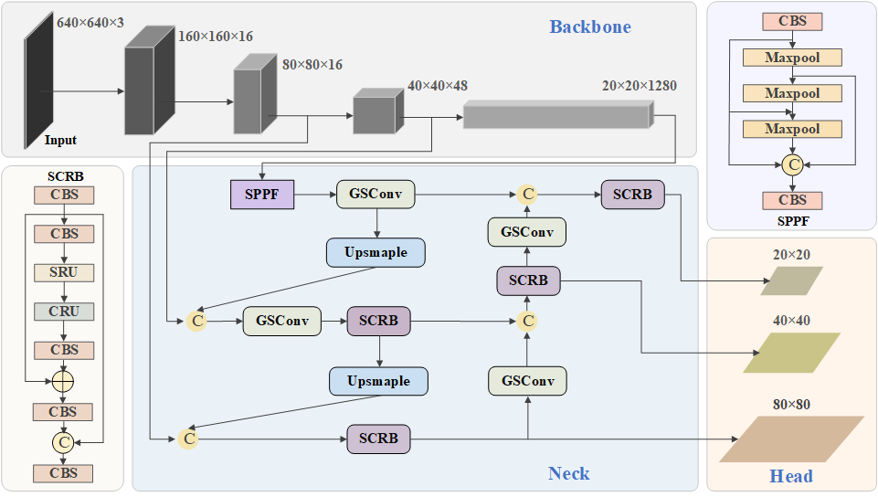
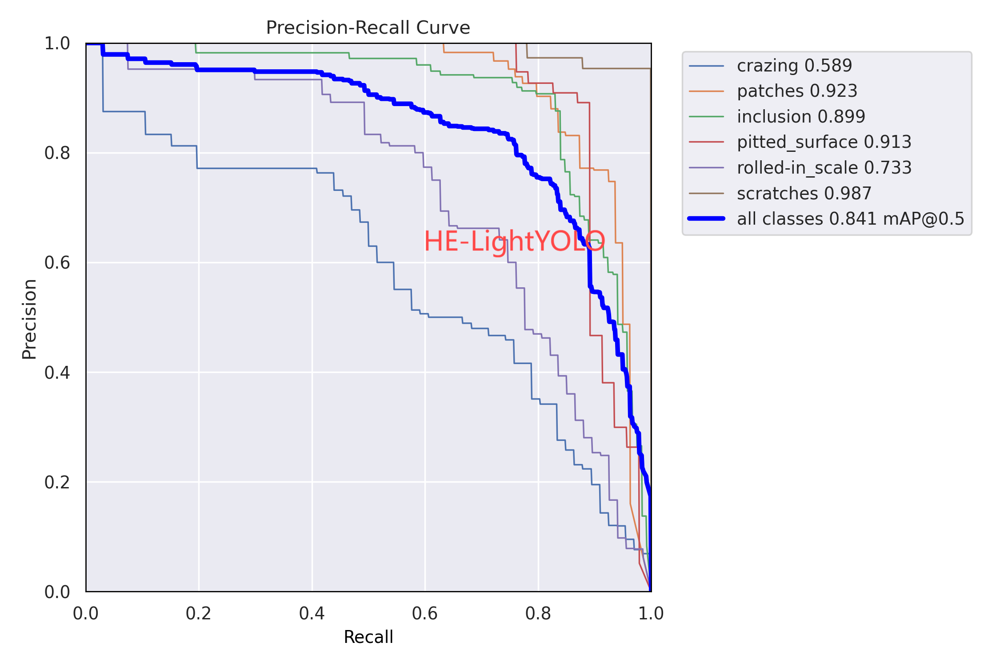
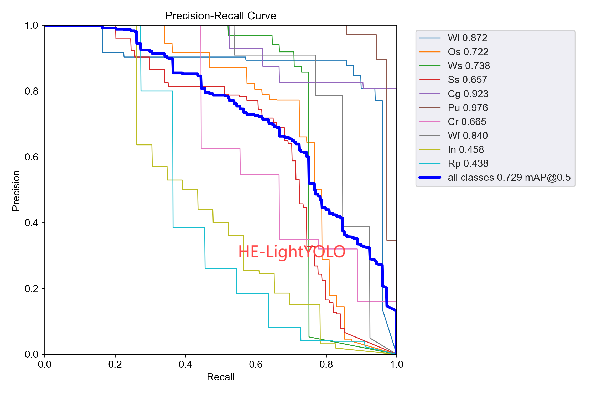
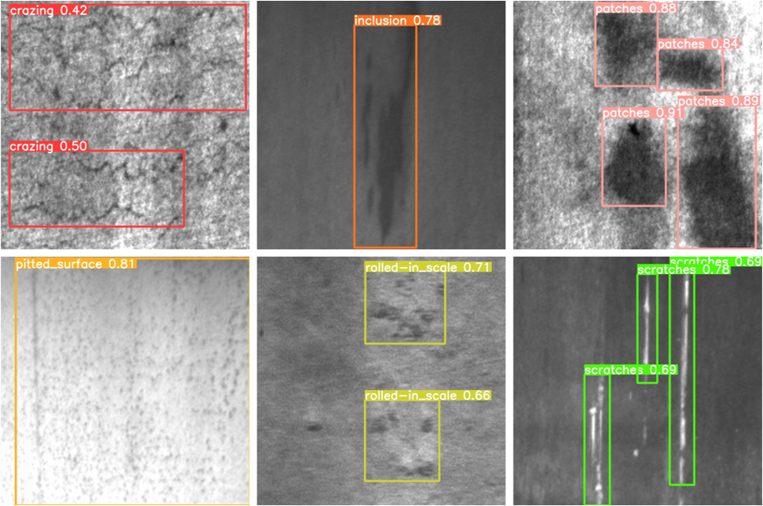
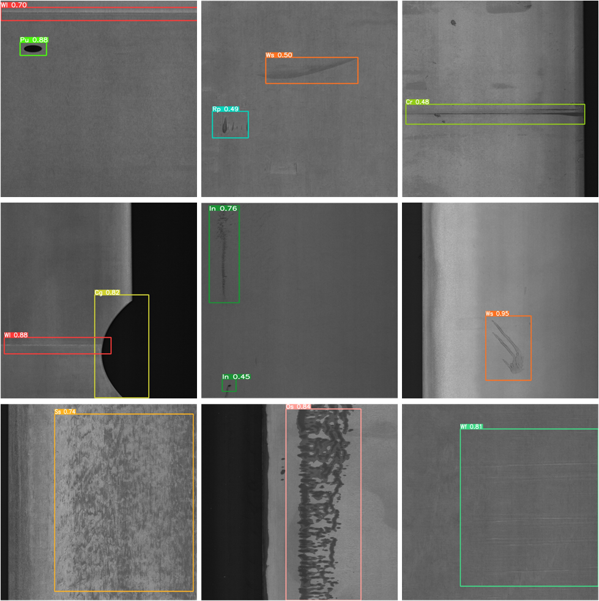

# HEL-YOLO
An highly efficient and lightweight YOLO for steel surface defects detection

## Introduction
Here is the structure of the forthcoming HEL-YOLO.

## :open_file_folder: Dataset and Weight

## :trophy: Result

PR result plot on NEU-DET

PR result plot on GC10-DET

## Visualization of detection results

NEU-DET

GC10-DET

